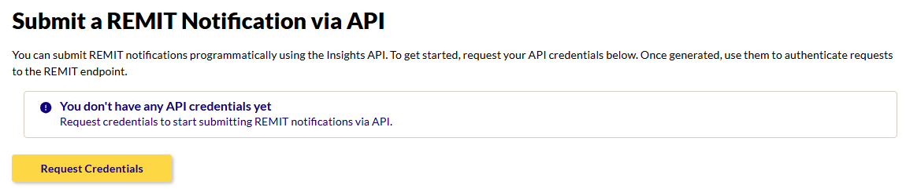
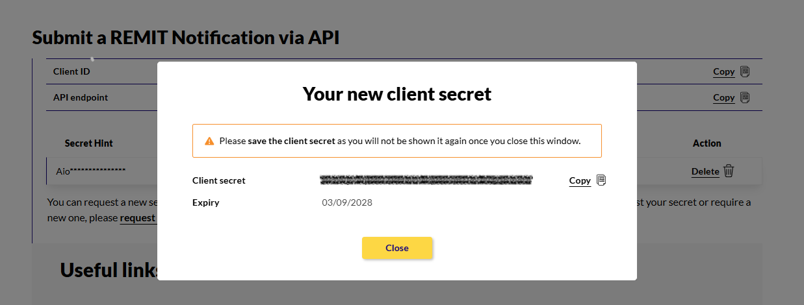
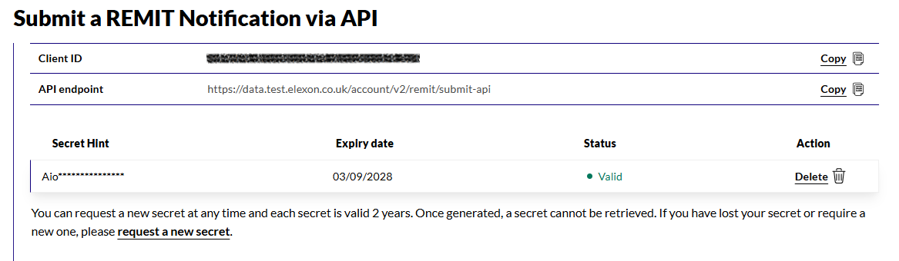

# REMIT Submit API

Elexon's [Insights Solution](https://bmrs.elexon.co.uk/remit) serves as the Inside Information Platform (IIP) for the GB electricity market and provides GB market participants with an API capability to submit REMIT data, as set out under BSC Modification P497.

The REMIT Submit API can be used instead of the existing Elexon Portal API or user interface. It is a POST endpoint that accepts XML and uses OAuth 2.0 authentication with the client credentials flow.

This repository contains example clients showing how to use the REMIT Submit API. Currently we have clients written in **C#/.NET**, **Node.js**, and **Python**.

## Before you begin: generate your credentials

> **Start with the [Test Insights Solution](https://bmrs.test.elexon.co.uk/login).** You can use this to test your setup and rehearse submissions.

1. Login to the Insights website ([Test](https://bmrs.test.elexon.co.uk/login) or [Prod](https://bmrs.elexon.co.uk/login)) and navigate to Submit a REMIT Report.
2. Generate your credentials by clicking 'Request Credentials'
   
3. You will see a pop-up that shows your new client secret. Make sure you copy that, as it won't be shown again.

4. Note down your **Client ID** and **Client secret**. You will use them when calling the API.

## Authentication

Use your client ID and client secret to fetch your access token using the following details:

- **Token endpoint:** `POST https://login.microsoftonline.com/4203b7a0-7773-4de5-b830-8b263a20426e/oauth2/v2.0/token`
- **Grant type:** `client_credentials`

The scope and submit endpoint are dependent on environment:

| Environment | Scope | Submit endpoint |
| --- | --- | --- |
| Test | `https://data.test.elexon.co.uk/account-api-v2/.default` | `POST https://data.test.elexon.co.uk/account/v2/remit/submit-api` |
| Prod | `https://data.elexon.co.uk/account-api-v2/.default` | `POST https://data.elexon.co.uk/account/v2/remit/submit-api` |

## Writing your REMIT XML

Validate your REMIT notification against the XSD schema before submitting it. Two schema versions are available in [`schemas/`](schemas/):

- [`remit2_0.xsd`](schemas/remit2_0.xsd) — targets `http://bmreports.com/XSD/2.0/remit.xsd`.
- [`remit2_1.xsd`](schemas/remit2_1.xsd) — targets `http://bmreports.com/XSD/2.1/remit.xsd`.

For security reasons, the REMIT Submit API also rejects notifications whose field values contain:

- **Formula injection characters** — e.g. values starting with characters that spreadsheet applications interpret as formulas.
- **Hyperlinks** — e.g. values containing links.
- **Newlines** — line breaks are blocked to guard against log injection.

You can validate your submission against the Test environment, and view your published submission on Test Insights, before submitting it on Prod.

## Response codes and messages

See [`Response codes`](RESPONSE_CODES.md) for the REMIT Submit API's success/error response shapes.

## Example clients

We provide example clients in the following languages:
- [C# / .NET](dotnet/RemitClient/README.md)
- [Node.js](nodeJs/README.md)
- [Python](python/README.md)

Each client folder has its own `README.md` with setup and run instructions. All three follow the same flow:

1. Load the `ClientId` and `ClientSecret` from a local settings file, and provide the path to your REMIT XML file as a command-line argument.
2. Request an access token from Microsoft Entra ID using the `client_credentials` grant.
3. `POST` the XML file's contents to the REMIT Submit API.
4. Print the response.

## Feedback

We're continuously improving REMIT submission. Help us improve the service by sharing your feedback at insightssupport@elexon.co.uk.

We also welcome contributions and suggestions directly to this repository. Please see our [contributing guidelines](./CONTRIBUTING.md) for more information.

## License

This project is licensed under the MIT License - see the [LICENSE](LICENSE) file for details.
